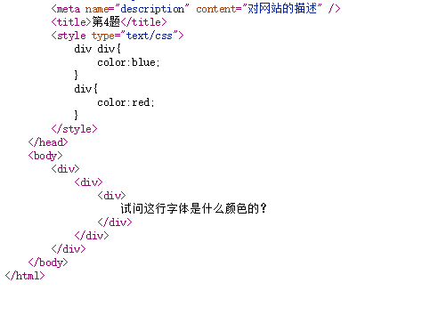
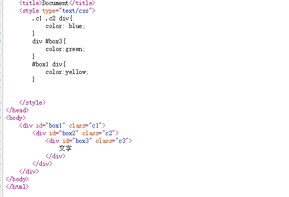
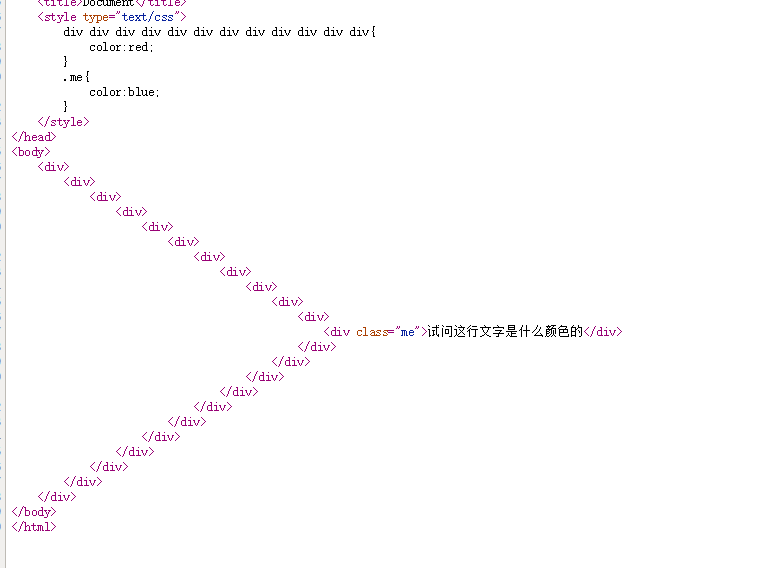

#权重作业
  
这行字应该是blue  
因为div+div的权重是0 0 2   
一个div的权重是0 0 1  
所以前者权重大
---
  
这个文字应为yellow  
因为在第一个使用了两个类选择器+一个标签选择器 权重为0 2 1  
第二个是一个标签+一个id选择器则是1 0 1  
第三个也是一个ID+一个标签 权重为1 0 1  
第二和第三 就近是黄色
---

第三题应为blue  
第一个有12个标签选择器 但为 0 0 12  
第二个一个类选择器 为 0 1 0  
高位有数权重大 所以为蓝色
